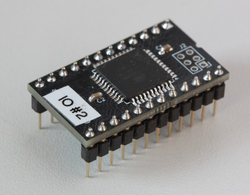

# PROM replacement for Elwro 800 Junior - ATF1502ASL SMD variant

Elwro 800 Junior uses two `SN74S474` 512x8 PROMs as IO and memory address decoders. These PROMs are increasingly difficult to obtain (and program), this project provides a plug-in replacement for both address decoders based on `ATF1502ASL` CPLD in `TQFP-44` package.

Note: there is [another version](https://github.com/codepainters/e800j_addr_dec_gal/) using `GAL16V8` in `DIL-20`. 

Hardware files:

* [pcb](pcb) - schematic/PCB project in KiCAD 8 format
* PDF schematics - [color](pdf/addr_dec.pdf) and [black&white](pdf/addr_dec_bw.pdf)
* [interactive BOM](addr_dec_atf_ibom.html) file (you have to download it and open locally)
* Gerber files (in a [jlcpcb](https://jlcpcb.com/)-compatible ZIP format):
  * [addr\_dec\_atf.zip](gerbers/addr_dec_atf.zip) - single PCB
  * [addr\_dec\_atf\_panel.zip](gerbers/addr_dec_atf_panel.zip) - two PCBs panelized

For bitstream files and programming instructions go to [bitstreams](bitstreams).

Under [src](src) you can find Quartus projects for I/O and MEM decoders (look there for details).

