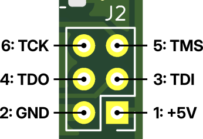

# Bitstreams

The `ATF1502ASL` can be programmed using [OpenOCD](https://openocd.sourceforge.io/) (or any other software handling `.svf` files) with a supported `JTAG` interface. I have successfully programmed the chips using a `Segger J-Link v8` clone. 

`JTAG` connector `J2` pin-out (you have to provide +5V supply):




## Files

The `ocd.sh` shell script is a wrapper around `openocd`, it takes a `svf` file name as its only parameter, e.g.:

```sh
$ ./ocd.sh addr_dec_io.svf
```

If you want to use other JTAG probe, edit the file accordingly (look for `-c "interface jlink"`).

The following `svf` files are available:
* `addr_dec_io.svf` - for I/O address decoder
* `addr_dec_mem.svf ` - for memory address decoder
* `atf1502asl_erase.svf` - helper file for erasing the `ATF1502ASL` chip

